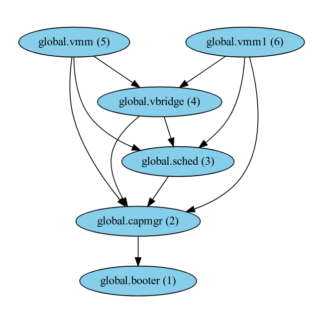

# Advanced OS Summary
We implemented an inter-vm communication through shared memory on Composite.
Here is a demo video in of it running on top of Qemu: [video](https://drive.google.com/file/d/1Le-CAXy2nqJmh9ZPNjELZ4wd4T_RtXq0/view?usp=sharing)

## Design and Summary
### Setting up the shared memory
Hypervisors (VMMs) set up the shared memory regions. Each shared memory region is registered with the `vbridge` component, with ip/port pairs. When another VMM wants to use the shared memory, it can use the `vbridge` component to get the `shared memory id` by providing the ip/port pair. The `vbridge` component will then return the `shared memory id`, which can be used to access the shared memory region.
The shared memory consists of a ring buffer provided by `ck` (`/src/components/lib/component/shm_ck_ring.h`). 

Below is the component graph that we used to test our implementation.

### Communication
Each VMM has two threads: `tx` and `rx`. The `tx` thread repeatedly copies data from virtio into a packet and enqueues it in a ring buffer. The `rx` thread dequeues from the ring buffer and copies it back to the virtio. Current mechanism constantly polling the ring buffer, which is not efficient. The VMM's IP addresses are hard coded both in VM image and in corresponding `vmm` components.

### Client and Server
The server is implemented in `echo_server.c`, and the client is implemented in `rtt_client.c`. The server listens for incoming connections on a hard coded port and IP address. When a client connects, it sends a message to the server, which echoes it back. The client measures the round trip time (RTT) for each message sent and its corresponding echo received.
We wanted to run it on baremetal to see accurate performance results, but the existing virtualization does not support the hardware of the embedded computer and dell desktop we have in the lab. We ran it on Qemu instead.

## Instructions
- We ran our tests via `vmm_multi_test.toml` 
- Component `vmm` uses `simple_vmm.vmm`, it runs the server `echo_server.c` with an IP of `15.15.15.1` at port `12345`
- Component `vmm1` uses `simple_vmm.vmm_client`, it runs the client `rtt_client.c` with an IP of `15.15.15.2`
